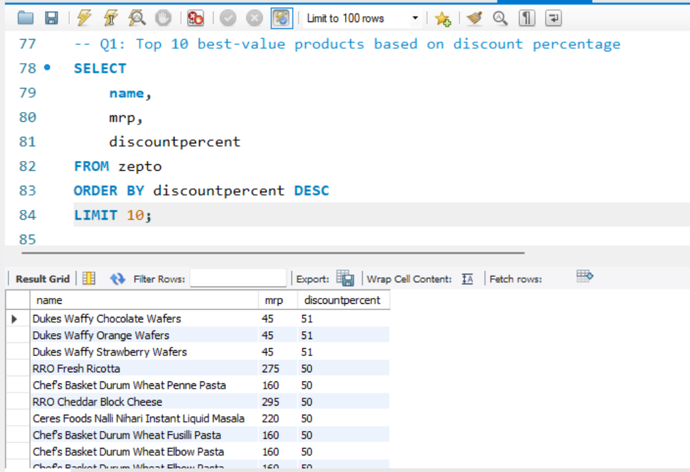
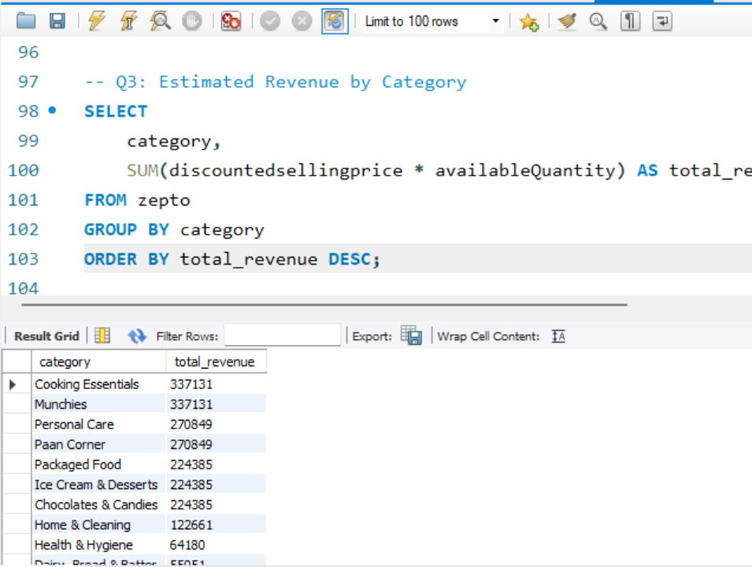
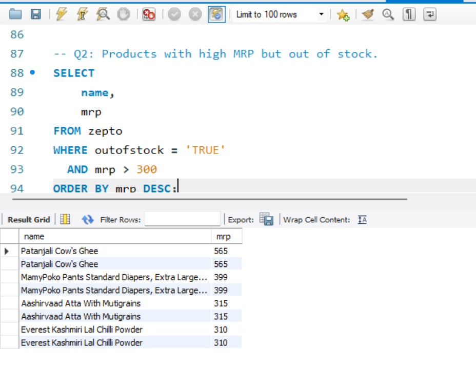

# 🛒 Zepto Sales Analysis Using SQL

Analyze Zepto's product data using SQL to uncover pricing trends, discount strategies, inventory patterns, and category-level revenue insights.

---

## 📌 Project Overview

This project performs end-to-end analysis of Zepto's product dataset using **MySQL**. The workflow includes:

* Data Exploration
* Data Cleaning
* Descriptive Analysis
* Business Analysis
* Advanced SQL Analysis

The objective is to generate actionable business insights related to pricing, discounts, inventory management, and revenue performance.

---

## 📊 Dataset Overview

The dataset contains product-level information from Zepto, including:

* Product Name
* Category
* MRP
* Discounted Selling Price
* Discount Percentage
* Available Quantity
* Product Weight
* Stock Availability

---

## 📂 Project Structure

```text
Zepto-Sales-Analysis-SQL-Project/
│
├── zepto_sql_project.sql
├── dataset/
│   └── zepto.csv
│
├── Assets/
│   ├── top_10.png
│   ├── revenue.png
│   └── high.png
│
└── README.md
```

---

## 🧮 SQL Concepts Used

* Data Exploration
* Data Cleaning
* Aggregate Functions (SUM, AVG, COUNT)
* Filtering (WHERE, HAVING)
* GROUP BY & ORDER BY
* CASE Statements
* Common Table Expressions (CTEs)
* Window Functions

  * DENSE_RANK()
  * ROW_NUMBER()
  * SUM() OVER()
* Revenue Analysis
* Inventory Analysis
* Product Segmentation

---

## 🔍 Analysis Performed

### Data Exploration

* Total records analysis
* Missing value checks
* Duplicate product identification
* Category exploration
* Stock availability analysis

### Data Cleaning

* Removed invalid records
* Converted paise values into rupees
* Validated product pricing information

### Business Analysis

* Top discounted products
* Revenue estimation by category
* High-value out-of-stock products
* Category-wise discount analysis
* Price-per-gram analysis
* Inventory weight analysis

### Advanced SQL Analysis

* Revenue contribution percentage by category
* Top 3 most expensive products per category
* Most discounted products by category
* Stock-out risk analysis
* Product price segmentation

---

## 🚀 Key Insights

| Area                      | Insight                                                                          |
| ------------------------- | -------------------------------------------------------------------------------- |
| 💰 Revenue Analysis       | A few categories contribute the majority of estimated revenue                    |
| 🔝 Discount Strategy      | Several products offer significant discounts, creating promotional opportunities |
| 🚫 Stock Availability     | Multiple high-value products are frequently out of stock                         |
| ⚖️ Value Analysis         | Price-per-gram calculations identify the best-value products                     |
| 📦 Inventory Distribution | Inventory is concentrated in specific categories                                 |
| 🎯 Product Segmentation   | Products can be grouped into Budget, Mid-Range, and Premium segments             |

---

## 🎯 Business Value

This analysis helps businesses:

* Identify high-performing categories
* Monitor inventory shortages
* Optimize pricing strategies
* Evaluate discount effectiveness
* Improve stock planning
* Understand category-level revenue contribution

---

## 📸 SQL Query Snapshots

### 1️⃣ Top 10 Best-Value Products Based on Discount Percentage

<p align="center">
  
</p>

### 2️⃣ Estimated Revenue by Category

<p align="center">
  
</p>

### 3️⃣ High MRP Products Currently Out of Stock

<p align="center">
  
</p>

---

## 🛠️ Tools Used

* MySQL
* Excel
* CSV Dataset

---

## 👨‍💻 Author

**Shahid Ali**

Aspiring Data Analyst skilled in SQL, Excel, Power BI, Python, Pandas, and Data Visualization.

### Connect With Me

LinkedIn: https://www.linkedin.com/in/shahid-ali-6556b337b

---

⭐ If you found this project useful, consider giving it a star.
