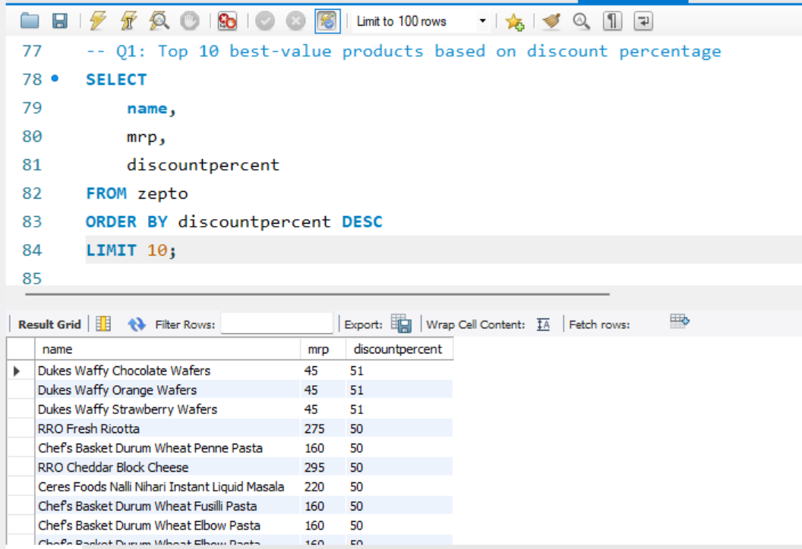
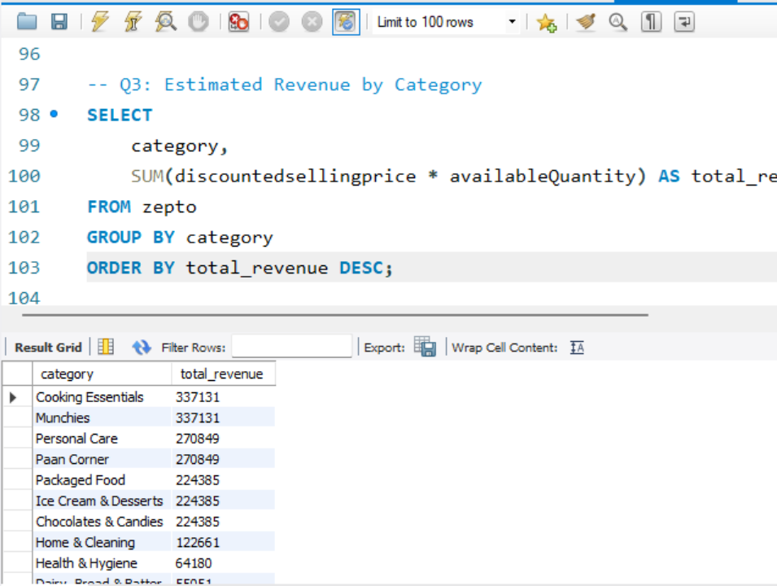
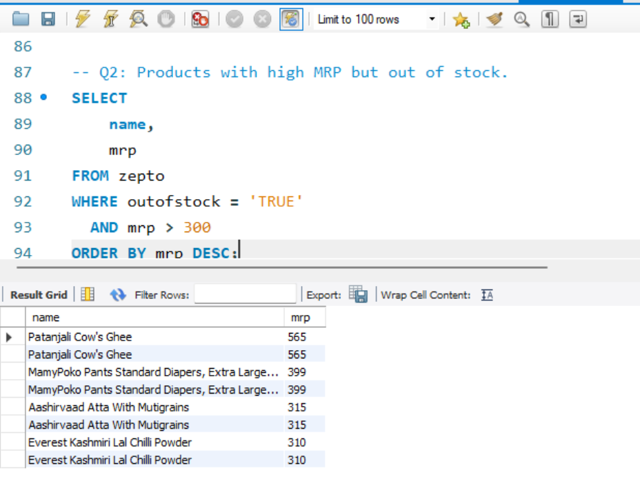

# 🛒 Zepto-Sales-Analysis-SQL-Project
Analyze Zepto’s product data using SQL to uncover pricing and inventory insights.
--

This project explores and analyzes product data from **Zepto**, an e-commerce platform, using **MySQL**.  
The goal is to perform **data cleaning**, **exploration**, and generate **business insights** such as best-value products, stock analysis, and revenue by category.

---

## 📂 Project Structure

- `zepto_sql_project.sql` → All SQL queries (exploration, cleaning, and analysis)
- `Zepto_SQL_Project_Report.pdf` → Final report with queries & explanations
- `dataset/zepto.csv` → Raw dataset used for the project

---

## 🧮 SQL Concepts Used

- Data Exploration  
- Data Cleaning  
- Aggregation (SUM, AVG, COUNT)  
- Filtering (WHERE, HAVING)  
- Grouping (GROUP BY)  
- Sorting & Ranking  
- Case Statements  

---

## 🚀 Key Insights

- Found **top 10 best-value products** based on discount percentage.  
- Identified **high MRP but out-of-stock** products.  
- Estimated **total revenue** per category.  
- Grouped products into **Low, Medium, and Bulk** weight categories.  
- Calculated **price per gram** for value comparison.  

---

## 🧰 Tools Used
- **MySQL** (Querying & Analysis)
- **Excel / CSV** (Data Preparation)

---
## 📸 SQL Query Snapshots

Here are a few example queries from the project:

### 🔹 1. Top 10 Best-Value Products Based on Discount Percentage

  

### 🔹 2. Estimate Revenue by Category

  

### 🔹 3. Products with High MRP but Out of Stock

  

---

## ✍️ Author  
🧑‍💻 **Shahid Ali**  
🎯 *Aspiring Data Analyst | SQL | Excel | Power BI | MySQL | Python*  
🔗 [LinkedIn Profile](https://www.linkedin.com/in/shahid-ali-6556b337b)

